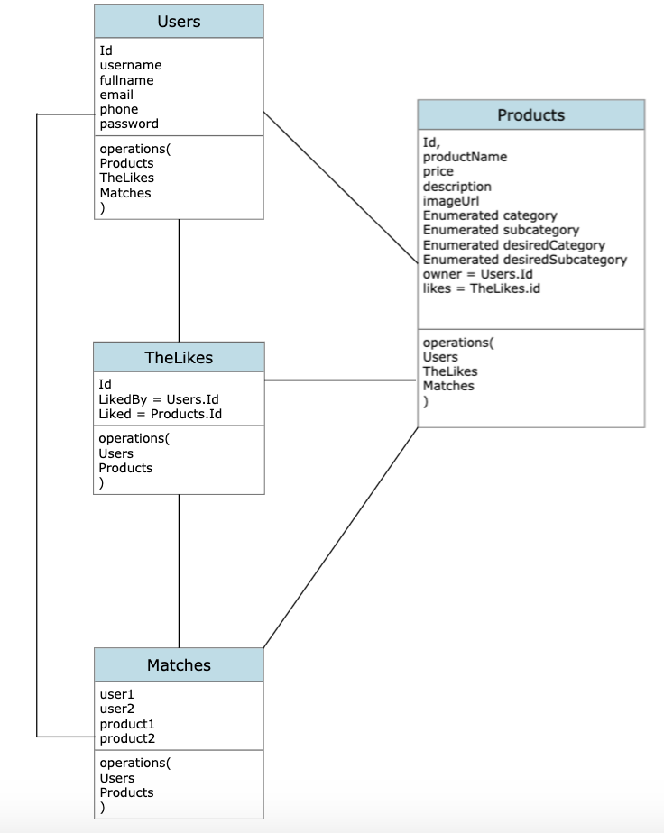
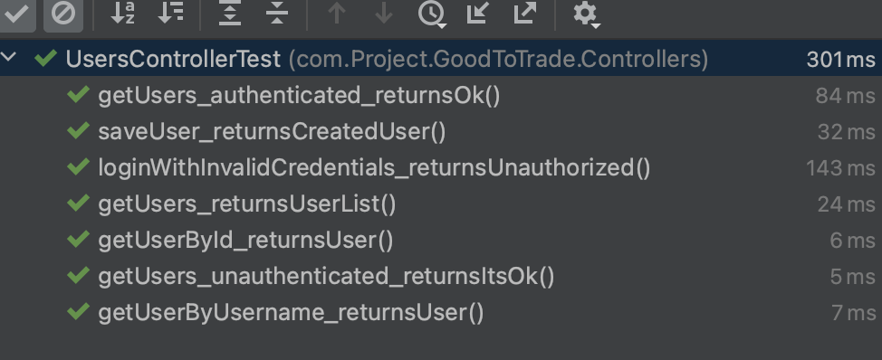
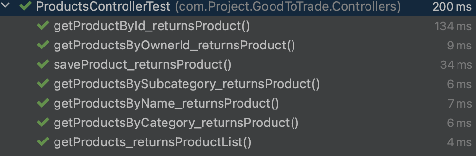
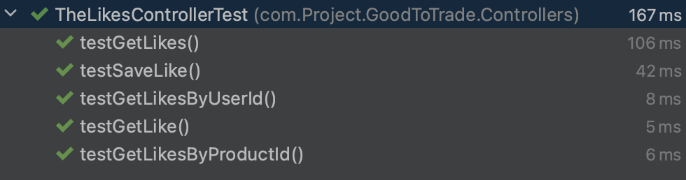

# GoodToTrade Project

## Descripción del Proyecto

Este proyecto es una aplicación Spring Boot que permite a los usuarios interactuar con una plataforma de comercio de bienes de segunda mano. Los usuarios pueden listar productos, dar "me gusta" a los productos, y realizar "matches" entre productos y usuarios para realizar un intercambio. La seguridad de la aplicación está manejada mediante autenticación y autorización personalizadas.

## Diagrama de Clases

## Configuración

1. Clonar el repositorio.
2. Asegurarse de tener instalado Java 11 y Maven.
3. Navegar hasta la carpeta del proyecto y ejecutar `mvn clean install`.
4. Para iniciar la aplicación, ejecutar `mvn spring-boot:run`.

## Tecnologías Utilizadas

- *Spring Boot*: Utilizado como el marco principal de la aplicación, Spring Boot facilita la creación de aplicaciones basadas en Spring autónomas y productivas.

- *Spring Security*: Añade una capa de seguridad a la aplicación, controlando el acceso a las rutas a través de autenticación y autorización.

- *Spring Data JPA*: Proporciona una capa de abstracción sobre la persistencia de datos, facilitando el acceso a los datos en las bases de datos SQL.

- *MySQL*: Como sistema de gestión de bases de datos, MySQL se utiliza para almacenar y recuperar los datos de la aplicación.

- *Maven*: Como herramienta de gestión de proyectos, Maven se utiliza para manejar las dependencias del proyecto.

## Estructura de Controladores y Rutas

Los controladores de la aplicación definen las siguientes rutas:

- `UsersController:` Controla las operaciones CRUD para los usuarios.
    - GET /api/users : Obtiene una lista de todos los usuarios.
    - GET /api/users/{id} : Obtiene un usuario específico por su ID.
    - GET /api/users/username/{username} : Obtiene un usuario específico por su nombre de usuario.
    - POST /api/users : Crea un nuevo usuario.
    - PUT /api/users/{id} : Actualiza un usuario específico.
    - DELETE /api/users/{id} : Elimina un usuario específico.

- `RoleController:` Controla la asignación de roles a usuarios.
    - POST /api/roles : Crea un nuevo rol.
    - POST /api/roles/addtouser : Asigna un rol a un usuario específico.

- `ProductsController:` Controla las operaciones CRUD para los productos.
    - GET /api/products : Obtiene una lista de todos los productos.
    - GET /api/products/{id} : Obtiene un producto específico por su ID.
    - GET /api/products/name/{productName} : Obtiene un producto específico por su nombre.
    - GET /api/products/category/{category} : Obtiene productos por su categoría.
    - GET /api/products/subcategory/{subcategory} : Obtiene productos por su subcategoría.
    - GET /api/products/owner/{ownerId} : Obtiene productos por su propietario.
    - POST /api/products : Crea un nuevo producto.
    - PUT /api/products/{id} : Actualiza un producto específico.
    - DELETE /api/products/{id} : Elimina un producto específico.

- `TheLikesController:` Controla las operaciones CRUD para los "likes" de los productos.
    - GET /api/likes : Obtiene una lista de todos los "likes".
    - GET /api/likes/{id} : Obtiene un "like" específico por su ID.
    - GET /api/likes/likedBy/{userId} : Obtiene los "likes" realizados por un usuario específico.
    - GET /api/likes/liked/{productId} : Obtiene los "likes" de un prodcuto específico.
    - POST /api/likes : Crea un nuevo "like".
    - PUT /api/likes/{id} : Actualiza un "like" en específico.
    - DELETE /api/likes/{id} : Elimina un "like" en específico.

- `MatchesController:` Controla las operaciones para los "matches" entre productos y usuarios.
    - GET /api/matches : Obtiene una lista de todos los "matches".
    - GET /api/matches/{id} : Obtiene nun "match" específico por su ID.
    - GET /api/matches/matcher/{matcherId} : Obtiene los "matches" realizados por un usuario específico.
    - GET /api/matches/match/{productId} : Obtiene los "matches" de un producto específico.
    - POST /api/matches : Crea un nuevo "match".
    - DELETE /api/matches/{id} : Elimina un "match" específico.

## Testing:

- `UsersController:`

  

- `UsersController:
`
  

- `UsersController:`

  
